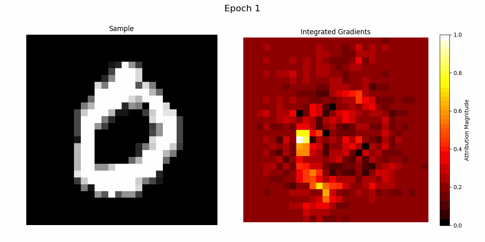

# TorchKAN: Simplified KAN Model with Variations

TorchKAN introduces a simplified KAN model and its variations, including KANvolver and KAL-Net, designed for high-performance image classification and leveraging polynomial transformations for enhanced feature detection.

## Table of Contents
1. Overview of the Simplified KAN Model
2. KANvolver: Monomial Basis Functions for MNIST Image Classification
3. KAL-Net: Utilizing Legendre Polynomials in Kolmogorov Arnold Legendre Networks
4. KAC-Net: Utilizing Chebyshev Polynomials 

This project showcases the training, validation, and quantization of the KAN model using PyTorch with CUDA acceleration. The `torchkan` model is evaluated on the MNIST dataset, demonstrating significant accuracy improvements.
## Project Status: Under Development

The KAN model has demonstrated promising outcomes across various Generative Additive Models (GAMs) since the 1980s. Inspired by a range of sources, this first implementation in `KAN` in `torchkan.py` achieves over 97% accuracy with an evaluation time of 0.6 seconds. The quantized model further reduces this to under 0.55 seconds on the MNIST dataset within 8 epochs, utilizing an Nvidia RTX 4090 on Ubuntu 22.04.

**My current understanding:** I am not sure of the huge hype with KANs, it is imperative to understand that learning weights for activation functions (MLPs) and learning the activation function themselves are pretty old ideas, its unclear how much interpretability they offer. Its also unclear how scalable, quantisable or efficient they are; as such it seems that the quantisability is not an issue and quantised evaluation on the base model leads to only ~0.6% drop in test performance. 

*Note: As the model is still being researched, further explorations into its full potential are ongoing. Contributions, questions, and critiques are welcome. I appreciate constructive feedback and contributions. Merge requests will be processed promptly, with a clear outline of the issue, the solution, and its effectiveness.*

**Note: The PyPI pipeline is currently deprecated and will be stabilized following the release of Version 1.**

---

### Introduction to the KANvolver Model

The `KANvolver` model is a specialized neural network designed for classifying images from the MNIST dataset. It achieves an at best accuracy of ~99.56% with a minimal error rate of 0.18%. This model combines convolutional neural networks (CNNs) with polynomial feature expansions, effectively capturing both simple and complex patterns.

I am conducting large-scale analysis to investigate how KANs can be made more interpretable.

Thanks to @cometscome to have written this version in Julia: https://github.com/cometscome/FluxKAN.jl

### Model Architecture

**Convolutional Feature Extraction:** The model begins with two convolutional layers, each paired with ReLU activation and max-pooling. The first layer employs 16 filters of size 3x3, while the second increases the feature maps to 32 channels.

**Polynomial Feature Transformation:** Post feature extraction, the model applies polynomial transformations up to the n'th order to the flattened convolutional outputs, enhancing its ability to discern non-linear relationships.

**How Monomials Work:** In the context of this model, monomials are polynomial powers of the input features. By computing monomials up to a specified order, the model can capture non-linear interactions between the features, potentially leading to richer and more informative representations for downstream tasks.

For a given input image, the monomials of its flattened pixel values are computed, which are then used to adjust the output of linear layers before activation. This approach introduces an additional dimension of feature interaction, allowing the network to learn more complex patterns in the data.

### Forward Propagation Process

1. **Input Reshaping:** Images are reshaped from vectors of 784 elements to 1x28x28 tensors for CNN processing.
2. **Feature Extraction:** Spatial features are extracted and pooled through convolutional layers.
3. **Polynomial Expansion:** Features undergo polynomial expansion to capture higher-order interactions.
4. **Linear Processing:** The expanded features are processed by linear layers with normalization and activation.
5. **Output Generation:** The network produces logits for each digit class in MNIST.

### Performance and Conclusion

The `KANvolver` model's 99.5% accuracy on MNIST underscores its robustness in leveraging CNNs and polynomial expansions for effective digit classification. While showing significant potential, the model remains open for further adaptation and exploration in broader image processing challenges. Here are the results:

### Integrated Gradients for Primary Explainability




Note KANvolver uses polynomials which are distinct from the original KANs[1].

---

## Introducing KAL_Net

The `KAL_Net` represents the **Kolmogorov Arnold Legendre Network (KAL-Net)**, a GAM architecture using Legendre polynomials to surpass traditional polynomial approximations like splines in KANs.

### Key Features

- **Polynomial Order:** Utilizes Legendre polynomials up to a specific order for each input normalization, capturing nonlinear relationships more efficiently than simpler polynomial approximations.
- **Efficient Computations:** By leveraging `functools.lru_cache`, the network avoids redundant computations, enhancing the forward pass's speed.
- **Activation Function:** Employs the SiLU (Sigmoid Linear Unit) for improved performance in deeper networks due to its non-monotonic nature.
- **Layer Normalization:** Stabilizes each layer's output using layer normalization, enhancing training stability and convergence speed.

### Design and Initialization

1. **Weight Initialization:** Weights are initialized using the Kaiming uniform distribution, optimized for linear nonlinearity, ensuring a robust start for training.
2. **Dynamic Weight and Normalization Management:** Manages weights for base transformations and polynomial expansions dynamically, scaling with input features and polynomial order.

## Advantages Over Splines (Pending Rigorous Empirical Testing)

- **Flexibility in High-Dimensional Spaces:** Legendre polynomials offer a more systematic approach to capturing interactions in high-dimensional data compared to splines, which often require manual knot placement and struggle with dimensionality issues.
- **Analytical Efficiency:** The caching and recurrence relations in Legendre polynomial computations minimize the computational overhead associated with spline evaluations, especially in high dimensions.
- **Generalization:** The orthogonal properties of Legendre polynomials typically lead to better generalization in machine learning model fitting, avoiding common overfitting issues with higher-degree splines.

## Performance Metrics

- **Accuracy:** `KAL_Net` achieved a remarkable **97.8% accuracy on the MNIST dataset**, showcasing its ability to handle complex patterns in image data.
- **Efficiency:** The average forward pass takes only **500 microseconds**, illustrating the computational efficiency brought by caching Legendre polynomials and optimizing tensor operations in PyTorch.

## Prerequisites

Ensure the following are installed on your system:

- Python (version 3.9 or higher)
- CUDA Toolkit (compatible with your PyTorch installation's CUDA version)
- cuDNN (compatible with your installed CUDA Toolkit)

## Installation

Tested on MacOS and Linux.

### 1. Clone the Repository

Clone the `torchkan` repository and set up the project environment:

```bash
git clone https://github.com/1ssb/torchkan.git
cd torchkan
pip install -r requirements.txt
```

### 2. Configure CUDA Environment Variables if Unset:

```bash
export PATH=/usr/local/cuda/bin:$PATH
export LD_LIBRARY_PATH=/usr/local/cuda/lib64:$LD_LIBRARY_PATH
```

### 3. Configure Weights & Biases (wandb)

To monitor experiments and model performance with wandb:

1. **Set Up wandb Account:**

- Sign up or log in at [Weights & Biases](https://wandb.ai).
- Locate your API key in your account settings.

2. **Initialize wandb in Your Project:**

Before running the training script, initialize wandb:

```python
wandb login
```

Enter your API key when prompted to link your script executions to your wandb account.

3. **Adjust the Entity Name in `mnist.py` to Your Username (default is `1ssb`)**

## Usage

```python
python mnist.py
```

This script trains the model, validates it, quantizes it, and logs performance metrics using wandb.

## Contact

For inquiries or support, please contact: Subhransu.Bhattacharjee@anu.edu.au

## Cite this Project

If this project is used in your research or referenced for baseline results, please use the following BibTeX entry.

```bibtex
@misc{torchkan,
  author = {Subhransu S. Bhattacharjee},
  title = {TorchKAN: Simplified KAN Model with Variations},
  year = {2024},
  publisher = {GitHub},
  journal = {GitHub repository},
  howpublished = {\url{https://github.com/1ssb/torchkan/}}
}
```

## Contributions

Contributions are welcome. Please raise issues as needed. Maintained solely by @1ssb.

## References

- [0] Ziming Liu et al., "KAN: Kolmogorov-Arnold Networks", 2024, arXiv. https://arxiv.org/abs/2404.19756
- [1] https://github.com/KindXiaoming/pykan
- [2] https://github.com/Blealtan/efficient-kan

---
